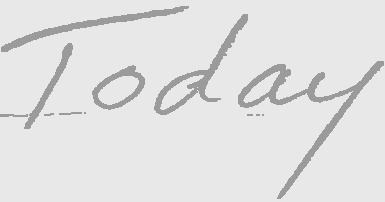
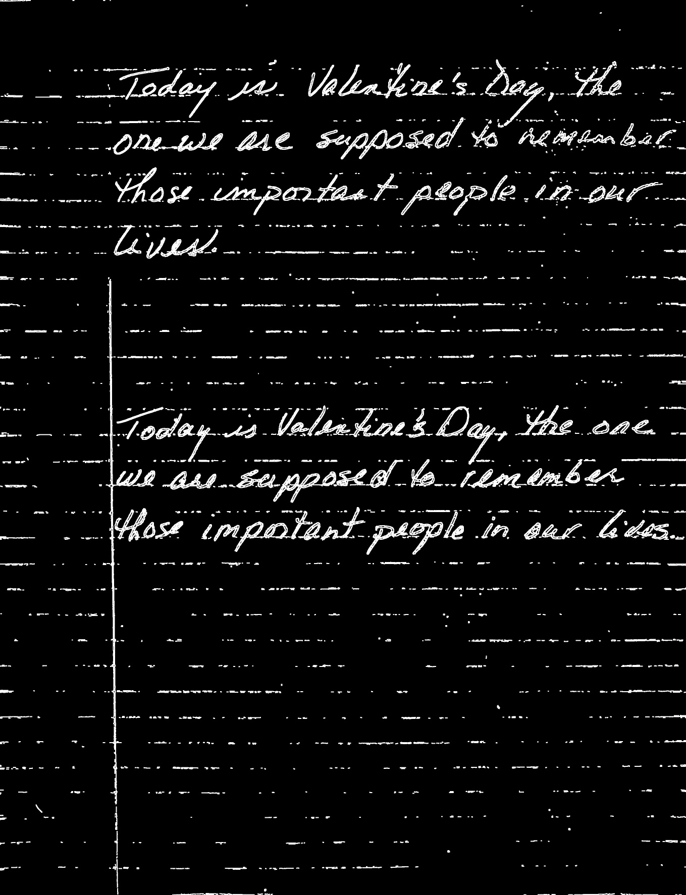
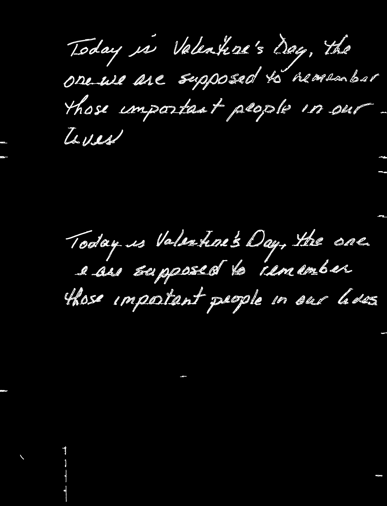
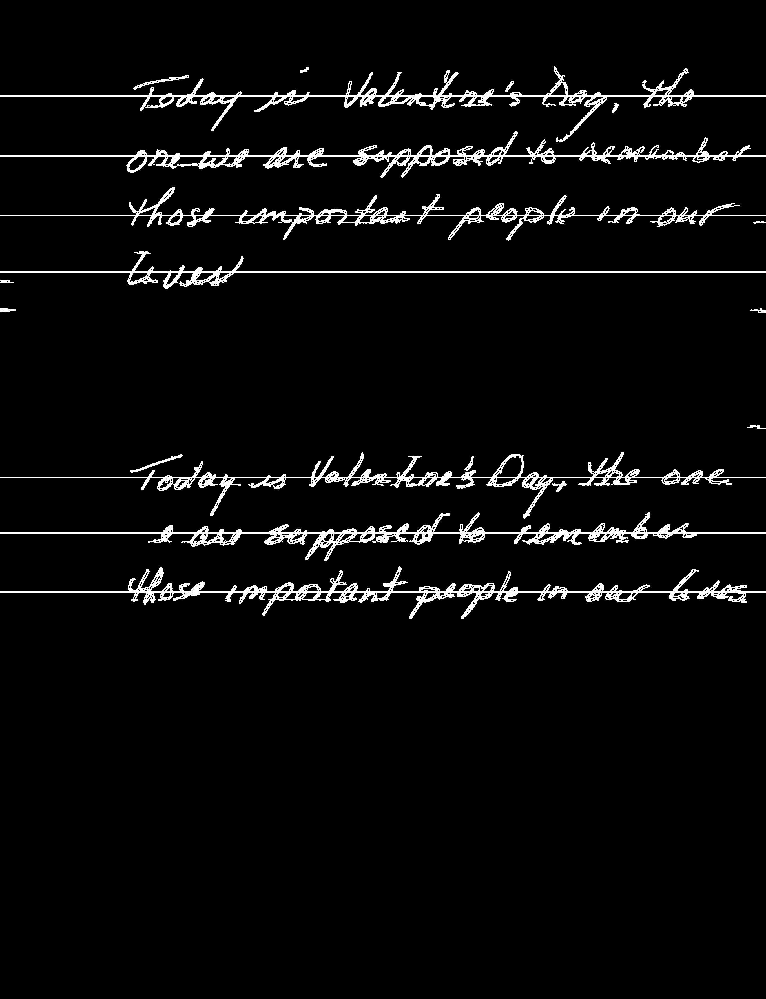
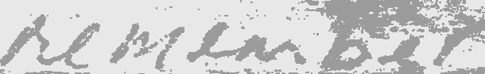
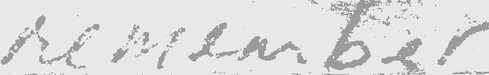

# PreprocessingHTR

This pre-processing system takes the image of a handwritten page and returns cleaned images of individual words. One such application of this is that the word images can be fed into Handwritten Text Recognition (HTR) systems, which often accept individual words.

This pre-processing prepares images for the [SimpleHTR](https://github.com/githubharald/SimpleHTR) system due to the way it prepares the final word images, however it is easily modifiable for other systems.



## Run pre-processing
```
> python main.py test.jpg --save processed
```
### Command line arguments
* `image`: the path to the input image
* `--save`: the path to which images of pre-processing steps will be saved.
* `--predict`: a boolean representing whether to predict the images when calling demo - not currently implemented.

## Assumptions

This work relies on a few key assumptions in order to function well:

* The input image is of a full, standard piece of paper with visible borders
* Text is written horizontally in non-overlapping lines
* Text height is fairly uniform across all lines
* Lighting conditions are acceptable - not too dark or too much glare

## Pre-processing Walkthrough

## Original image

This is the original image fed into the program. Ideally, this image should be of a full page where all borders of the page are visible. The page should also be as straight as possible.


## Bordered image

The first pre-processing step is to border the page.

This can be done fairly simply using `cv2.findContours` and by detecting the largest contour whose approximate shape is a square  (using `cv2.approxPolyDP`). Then, we can create an approximate rectangle from that contour and crop to it. The disadvantage to this method is that, if the page is not straight, either will the crop.

An alternative method is the `four_point_transform` from `imutils.perspective`, which actually transofrm the page to be straight while cropping it, however, because this sometimes leaves the paper warped, it is preferred  to simply use the first method.


## Page holes removed

To ensure that `cv2.canny` is as clean as possible, any page holes must be removed. This can be done with `cv2.SimpleBlobDetector`, which can detect approximate circles, and page holes with the right parameters.

To make the transition as smooth as possible, evenly-spaced points around the circled are sampled for color, those samples are averaged, and the hole is filled with this color. Then, the immediate area around the hole is blurred so that `cv2.canny` won't pick up much transition.


## Lines removed

Credit to https://vzaguskin.github.io/fourielines1/ for this technique, which uses hough lines and a Fourier transform to remove the lines. Doing this multiple times improves the output of `cv2.canny`, despite appearing to 'highlight' some sections of the page.


## Grayscale & Blurred

The image is then made grayscale and blurred in preparation for `cv2.canny`.


## Edges

Finally, apply `cv2.canny` to get the edges in the image, which is the a good way to identify text location on a now relatively bare page.


## Dilated edges

Perform dilation on canny, which yielded better results in practice (and is also better for visualization).




## Connected components

Perform `cv2.connectedComponentsWithStats` to analyze the components in the image.


## Connected components filtered

Filter the connected compontents based on different stats such as area, bounding area, height, and so on.




## Connected component borders

Get the borders of the connected components, which is helpful to determine/separate lines of text.


## Text lines

A simple clustering method is used based on a carefully calculated 'maxgap' between lines, which is based on the heights of the bounding boxes in the previous image.

Filtering is done for lines with too little area to contain text.




## Individual text lines

Once we've separated the document into lines, we must segment it into words. Currently, there are two methods being used to separate lines.

The first can be seen in the below images as the blue, vertical divider. It is based on taking column sums of the image's pixel values, finding gaps of values (i.e. runs of near 0) and classifying a gap as a space is large enough. This is no simple task, since gaps within some words are larger than the gaps between words - take the " 's " in "Valentine's", which was incorrectly identified as a space.

The second method can be seen in the below images as the green divider, and was inspired by the fact that some vertical gaps are made very small (or non-existent) due to slanted lettering. This addresses this short-coming of the first method, and in general, this method is better, however it does miss some spaces, as in the 5th line between 'Today' and 'is'.

Ideally, a combination of these methods could be used and tweaked to obtain more consistent results than either method could produce alone. Currently, only the first method is being used to segment sentences into words.


## Individual words

Currently, once individual words are segmented, they are thresholded and re-colored rather than being cropped from the original page. This is because the [SimpleHTR](https://github.com/githubharald/SimpleHTR) was built on the IAM dataset, which requires images with a very specific asthetic, as is shown below.

One issue with the model is that it will fail without warning on some images, which can be mitigated by using different thresholding methods for some reason.

In general, OTSU produces cleaner images, as seen with 'Today'. However, it is more suspectible to shadows and highlights than mean thresholding (given a good threshold value), as is the case with 'remember'.

Though not currently implemented, it might be possible to distinguish between the cleaner version of each threshold. For the reasons described above, if the pixel count in OTSU thresholded is comparable (probably slightly lower) to that in the mean thresholded, use OTSU. However, if mean thresholded has significantly less pixels, use this image.

OTSU Threshold


Mean Threshold


OTSU Threshold



Mean Threshold




## Future Changes

* Raw word images: Provide the option to get back raw word images rather than those doctored for the [SimpleHTR](https://github.com/githubharald/SimpleHTR) system.

* Word threshold selection: Try different threshold methods and use the 'cleanest' method. See *Individual words* section for more details.

* Colored pen considerations: Colored pen could be detected and extracted much more easily than pencil, however this isn't currently being taken advantage of.

* Improved scale-invariance: Some pre-processing steps are sensitive to image and text size, which should be accounted for in future developments. For example, the connected compontents area filtering is currently based on a fixed value, which will fail to work well with different sized images or text.

* K-means clustering: Currently, a simple clustering method is being used based on a carefully-chosen 'maxgap' between lines. However, this could be improved, or augmented, with K-means clustering. E.g. use the current method to determine the approximate number of lines, and use K-means to improve the clustering - find missing lines or remove unncessary lines.