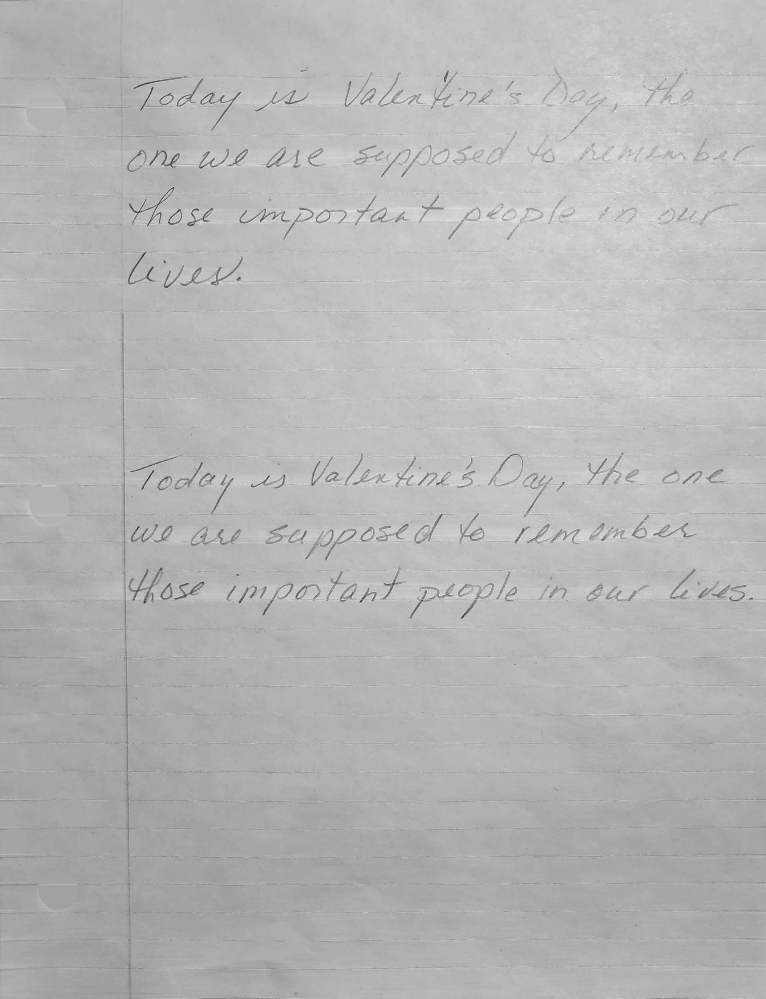

# PreprocessingHTR
Pre-processing handwritten pages into words for Handwritten Text Recognition (HTR).

Pre-processing system takes the image of a full, handwritten page and returns cleaned images of individual words. These individual word images can then be fed into a Handwritten Text Recognition (HTR) system, which often prefers individual words.


## Run pre-processing
```
> python main.py test.jpg --save processed
```
### Command line arguments
* `image`: the path to the input image
* `--save`: the path to which images of pre-processing steps will be saved.
* `--predict`: a boolean representing whether to predict the images when calling demo - not currently implemented.


## Pre-processing Walkthrough

## Original image


## Bordered image


## Page holes removed


## Lines removed


## Grayscale



## Blurred


## Edges


## Dilated edges


## Connected components


## Connected components filtered


## Connected component borders


## Text lines


## Individual text lines


## Individual words


## Short-comings

Colored pen could be detected and extracted much more easily than pencil, however this isn't currently being taken advantage of.